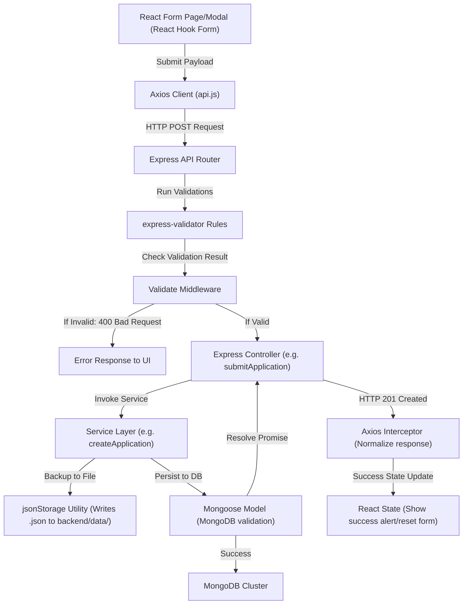

# Bundela Finance — Website Redesign & Developer Tutorial

Welcome to the **Bundela Finance Website Redesign** project! This is a modern, high-performance redesign of the [Bundela Finance website](https://www.bundelafinance.com/) built with a scalable monorepo architecture. 

This document serves as both the project documentation and an in-depth developer tutorial. By reading through this guide, you will understand the architecture, database models, validations, and the end-to-end data lifecycle of the application.

---

## Table of Contents
1. [Architecture Overview](#1-architecture-overview)
2. [Tech Stack](#2-tech-stack)
3. [Project Directory Structure](#3-project-directory-structure)
4. [Step-by-Step Data Lifecycles](#4-step-by-step-data-lifecycles)
    - [A. Loan Application Flow](#a-loan-application-flow)
    - [B. Dealership Registration Flow](#b-dealership-registration-flow)
    - [C. EMI Calculator Flow](#c-emi-calculator-flow)
5. [Database Models & Schemas](#5-database-models--schemas)
6. [Input Validation & Security Middleware](#6-input-validation--security-middleware)
7. [Frontend Global State & UX Components](#7-frontend-global-state--ux-components)
8. [Setup, Installation, & Running Locally](#8-setup-installation--running-locally)

---

## 1. Architecture Overview

The project is structured as a **Monorepo** comprising two main parts:
* **Frontend (`/frontend`)**: A React 19 single-page application (SPA) powered by Vite. It uses Tailwind CSS for styling, React Router DOM for routing, and Framer Motion for premium micro-animations and transitions.
* **Backend (`/backend`)**: A Node.js and Express REST API that connects to MongoDB via Mongoose. In addition to storing records in the database, it also backs up all form submissions locally as JSON files.

### End-to-End Data Flow Diagram


---

## 2. Tech Stack

### Frontend
* **Core:** React 19 + Vite (for lightning-fast bundling)
* **Styling:** Tailwind CSS (configured with dark-mode support)
* **Routing:** React Router DOM v6
* **Form Handling:** React Hook Form
* **Animations:** Framer Motion
* **Libraries:** Axios (API communication), Swiper.js (carousels), React CountUp (numerical animations), React Icons (feather & fontawesome icons)

### Backend
* **Core:** Node.js + Express.js
* **Database:** MongoDB + Mongoose ODM
* **Security & Utility:** Helmet (secures HTTP headers), Morgan (logs requests), Cors (manages cross-origin access), Nodemon (development live-reloading)
* **Validation:** `express-validator` middleware

---

## 3. Project Directory Structure

### Root Configuration
* [package.json](file:///c:/Users/deepak/OneDrive/Desktop/intern%20CUBEAI/package.json) - Defines monorepo scripts (concurrently starting dev servers, linting, formatting).
* [package-lock.json](file:///c:/Users/deepak/OneDrive/Desktop/intern%20CUBEAI/package-lock.json) - Lockfile for root dependencies.

---

### Backend Directory Structure
The backend codebase uses a clean, separation-of-concerns architecture:

```
backend/
├── data/                    # JSON file copies of form submissions (organized by category)
│   ├── applications/
│   ├── contacts/
│   ├── dealerships/
│   └── newsletters/
├── src/
│   ├── config/              # Environment vars & database connection setup
│   │   ├── db.js            # MongoDB connection logic (mongoose.connect)
│   │   └── env.js           # Env variables loader (dotenv)
│   ├── controllers/         # Express Controllers (handles HTTP request/response)
│   │   ├── applicationController.js
│   │   ├── contactController.js
│   │   ├── dealershipController.js
│   │   ├── healthController.js
│   │   └── newsletterController.js
│   ├── middleware/          # Express Custom Middlewares
│   │   ├── errorHandler.js  # Global error handling (handles duplicates, Mongoose validation errors)
│   │   ├── notFound.js      # 404 router handler
│   │   └── validate.js      # express-validator payload analyzer
│   ├── models/              # Mongoose DB Schemas
│   │   ├── Application.js
│   │   ├── Contact.js
│   │   ├── Dealership.js
│   │   └── Newsletter.js
│   ├── routes/              # Express Router endpoints mappings
│   │   ├── index.js         # Master API routing entry point
│   │   ├── healthRoutes.js
│   │   ├── applicationRoutes.js
│   │   ├── contactRoutes.js
│   │   ├── dealershipRoutes.js
│   │   └── newsletterRoutes.js
│   ├── services/            # Business logic (database operations & storage backups)
│   │   ├── applicationService.js
│   │   ├── contactService.js
│   │   ├── dealershipService.js
│   │   └── newsletterService.js
│   ├── utils/               # Common helper utilities
│   │   └── jsonStorage.js   # Local file storage backup handler (writes JSON files)
│   ├── validations/         # Request body validation rules
│   │   ├── applicationValidation.js
│   │   ├── contactValidation.js
│   │   ├── dealershipValidation.js
│   │   └── newsletterValidation.js
│   ├── app.js               # Express application configurations (security header plugins, CORS)
│   └── server.js            # Node HTTP server launcher
```

---

### Frontend Directory Structure
The frontend is built to be modern, scalable, and modular:

```
frontend/
├── src/
│   ├── assets/              # Static media files (logos, illustrations)
│   ├── components/          # Reusable UI React Components
│   │   ├── calculator/      # EMI Calculator UI sections
│   │   │   └── EmiCalculatorSection.jsx
│   │   ├── common/          # Common components (LoadingSpinner, ErrorBoundary, Backgrounds)
│   │   │   ├── ErrorBoundary.jsx
│   │   │   ├── LoadingSpinner.jsx
│   │   │   └── WakandaBackground.jsx
│   │   ├── forms/           # Form UI components using React Hook Form
│   │   │   ├── ApplicationForm.jsx
│   │   │   ├── ContactForm.jsx
│   │   │   ├── DealershipForm.jsx
│   │   │   └── NewsletterForm.jsx
│   │   ├── home/            # Sections exclusively used on the landing homepage
│   │   │   ├── HeroSection.jsx
│   │   │   ├── ServicesSection.jsx
│   │   │   ├── StatisticsSection.jsx
│   │   │   └── Navbar.jsx
│   │   ├── layout/          # Layout layout components (MainLayout shell, Header, Footer)
│   │   │   └── MainLayout.jsx
│   │   └── ui/              # Low-level primitives (Buttons, Inputs)
│   │       └── Button.jsx
│   ├── constants/           # Shared static lists (routes configs, contact details)
│   │   ├── config.js
│   │   └── routes.js
│   ├── context/             # Global states (Theme dark-mode, mobile menus)
│   │   └── AppContext.jsx
│   ├── data/                # Hardcoded slide details, teams metadata, and achievements lists
│   ├── pages/               # Lazy-loaded page view entrypoints
│   │   ├── Home.jsx
│   │   ├── About.jsx
│   │   ├── Contact.jsx
│   │   ├── ApplyNow.jsx
│   │   └── EmiCalculator.jsx
│   ├── routes/              # Client side path configuration
│   │   └── index.jsx
│   ├── services/            # Client HTTP requests using Axios Instance
│   │   ├── api.js           # Shared Axios Client configuration with interceptors
│   │   ├── applicationService.js
│   │   ├── contactService.js
│   │   ├── dealershipService.js
│   │   └── newsletterService.js
│   ├── styles/              # Global animations and additional CSS rules
│   ├── utils/               # Common helper formulas (EMI computations, formatters)
│   │   └── emiCalculator.js
│   ├── App.jsx              # Main App entry wrapper
│   ├── index.css            # Stylesheets with Tailwind and design tokens
│   └── main.jsx             # React client bundle renderer
```

---

## 4. Step-by-Step Data Lifecycles

To help you understand how the application works, let's walk through the exact code execution path for the most critical actions.

---

### A. Loan Application Flow
When a user visits the onboarding page or opens the "Apply Now" form modal and submits their loan application details:

1. **User Interaction & Validation on Client:**
   * The user enters information into the multi-step form inside [ApplicationForm.jsx](file:///c:/Users/deepak/OneDrive/Desktop/intern%20CUBEAI/frontend/src/components/forms/ApplicationForm.jsx).
   * React Hook Form monitors the inputs. In Step 1, fields like `fullName`, `mobile`, `dob`, and `service` are checked. In Step 2, document upload controls inspect the uploaded files (Aadhaar Card, PAN Card, Photo). 
   * When they click **Next**, the client invokes React Hook Form's `trigger()` function to check the current step's validity.

2. **Submitting the Payload:**
   * Upon submitting the final step, `onSubmit()` is triggered.
   * Files (Aadhaar, PAN, photo) are not uploaded as multipart binary files. Instead, their metadata (file name, file size in bytes, and mime type) is extracted into structured objects:
     ```js
     {
       name: "aadhaar_scan.pdf",
       size: 154820,
       type: "application/pdf"
     }
     ```
   * The component invokes `submitLoanApplication(payload)` from [applicationService.js](file:///c:/Users/deepak/OneDrive/Desktop/intern%20CUBEAI/frontend/src/services/applicationService.js).
   * This uses the shared Axios instance defined in [api.js](file:///c:/Users/deepak/OneDrive/Desktop/intern%20CUBEAI/frontend/src/services/api.js) to issue an HTTP `POST` request to `http://localhost:5000/api/applications`.

3. **Backend API Route:**
   * The backend application ([app.js](file:///c:/Users/deepak/OneDrive/Desktop/intern%20CUBEAI/backend/src/app.js)) forwards requests matching `/api` to the master router in [routes/index.js](file:///c:/Users/deepak/OneDrive/Desktop/intern%20CUBEAI/backend/src/routes/index.js).
   * The master router forwards requests matching `/applications` to [applicationRoutes.js](file:///c:/Users/deepak/OneDrive/Desktop/intern%20CUBEAI/backend/src/routes/applicationRoutes.js).
   * The route handler is configured as follows:
     ```js
     router.post('/', applicationValidation, validate, submitApplication);
     ```

4. **Input Verification:**
   * First, `applicationValidation` rules from [applicationValidation.js](file:///c:/Users/deepak/OneDrive/Desktop/intern%20CUBEAI/backend/src/validations/applicationValidation.js) check the data:
     * Trims and ensures `fullName` is under 100 characters.
     * Matches the `mobile` against `/^[6-9]\d{9}$/` to verify it is a valid 10-digit Indian number.
     * Checks if the selected `service` matches one of the approved types (e.g., `'e-auto'`, `'solar'`, `'used-car'`).
   * Next, the custom [validate.js](file:///c:/Users/deepak/OneDrive/Desktop/intern%20CUBEAI/backend/src/middleware/validate.js) middleware evaluates the validation results. If any criteria fail, it halts execution and returns a `400 Bad Request` containing an array of fields and error messages.

5. **Processing the Request:**
   * If validation succeeds, Express calls `submitApplication` in [applicationController.js](file:///c:/Users/deepak/OneDrive/Desktop/intern%20CUBEAI/backend/src/controllers/applicationController.js).
   * The controller hands the body parameters to the service tier in [applicationService.js](file:///c:/Users/deepak/OneDrive/Desktop/intern%20CUBEAI/backend/src/services/applicationService.js):
     ```js
     export const createApplication = async (data) => {
       await saveJsonSubmission('applications', data);
       const application = await Application.create(data);
       return application;
     };
     ```

6. **Local JSON Backup & Database Write:**
   * First, the service invokes `saveJsonSubmission` inside [jsonStorage.js](file:///c:/Users/deepak/OneDrive/Desktop/intern%20CUBEAI/backend/src/utils/jsonStorage.js).
   * This utility ensures the backup directory `backend/data/applications` exists. It generates a unique filename combining a timestamp and random characters (e.g., `1718451234_ab3f9d.json`), enriches the payload with a `_savedAt` ISO timestamp, and writes the JSON file using `fs.writeFile`.
   * Next, Mongoose writes to MongoDB:
     ```js
     const application = await Application.create(data);
     ```
     Mongoose validates the payload against [Application.js](file:///c:/Users/deepak/OneDrive/Desktop/intern%20CUBEAI/backend/src/models/Application.js) (ensuring required fields exist and setting the default status to `'pending'`).

7. **HTTP Response:**
   * The controller returns a `201 Created` status with details of the created application:
     ```json
     {
       "success": true,
       "message": "Loan application submitted successfully",
       "data": { "id": "603d...", "fullName": "John Doe", "loanType": "e-auto", "status": "pending" }
     }
     ```
   * On the client side, the Axios response interceptor resolves the promise with `response.data`.
   * The component sets `submitSuccess = true`, displays a green alert, resets the form inputs, and returns the stepper UI to the first step.

---

### B. Dealership Registration Flow
This flow handles dealership onboarding registrations:

1. **User Action:**
   * The user opens the Dealership Form Modal (triggered by clicking "Dealership Form" in the [Navbar.jsx](file:///c:/Users/deepak/OneDrive/Desktop/intern%20CUBEAI/frontend/src/components/home/Navbar.jsx)).
   * The user fills in details such as organization name, business type (dealer type, vehicle categories), banking details (bank name, account number, IFSC code), and drops document files.
2. **Client Call:**
   * Submits data to `submitDealershipForm(payload)` in [dealershipService.js](file:///c:/Users/deepak/OneDrive/Desktop/intern%20CUBEAI/frontend/src/services/dealershipService.js) which triggers `POST` to `/api/dealership`.
3. **Backend Middleware Rules:**
   * Matches request against [dealershipValidation.js](file:///c:/Users/deepak/OneDrive/Desktop/intern%20CUBEAI/backend/src/validations/dealershipValidation.js).
   * **IFSC validation:** Employs a regex constraint (`/^[A-Z]{4}0[A-Z0-9]{6}$/`) to ensure the bank code complies with standard Reserve Bank of India format rules.
4. **Service & Storage Action:**
   * Saves the structured payload to `backend/data/dealerships/` as a JSON file copy.
   * Saves the record to MongoDB under the `dealerships` collection (using the schema in [Dealership.js](file:///c:/Users/deepak/OneDrive/Desktop/intern%20CUBEAI/backend/src/models/Dealership.js)).

---

### C. EMI Calculator Flow
The EMI Calculator is purely mathematical and operates entirely on the client:

```
[User Input: Amount, Rate, Tenure] 
         ↓
  Validate Inputs 
         ↓
  Invoke calculateFlatEMI() & calculateReducingEMI()
         ↓
  Format outputs with Rupees format (₹)
         ↓
  Update Local React State
         ↓
  Animate and render comparative cards side-by-side
```

1. **User Inputs:**
   * The user inputs a loan amount (P), an annual interest rate percentage (R), and a tenure in months (T) into [EmiCalculatorSection.jsx](file:///c:/Users/deepak/OneDrive/Desktop/intern%20CUBEAI/frontend/src/components/calculator/EmiCalculatorSection.jsx).
2. **Formula Execution:**
   * Upon clicking "Calculate", inputs are validated to ensure they are positive numbers.
   * The component calls calculation utilities from [emiCalculator.js](file:///c:/Users/deepak/OneDrive/Desktop/intern%20CUBEAI/frontend/src/utils/emiCalculator.js):
     * **Flat Interest Formula:**
       * **Interest:** $I = \frac{P \times R \times (\frac{T}{12})}{100}$
       * **Total Payable:** $A = P + I$
       * **Monthly EMI:** $EMI = \frac{A}{T}$
     * **Reducing Balance Formula:**
       * **Monthly Interest Rate:** $r = \frac{R}{12 \times 100}$
       * **Monthly EMI:** $EMI = \frac{P \times r \times (1 + r)^T}{(1 + r)^T - 1}$
       * **Total Payable:** $A = EMI \times T$
       * **Total Interest:** $I = A - P$
3. **Rendering Results:**
   * The calculated values are formatted as currency (e.g., adding `₹` and commas) using [formatters.js](file:///c:/Users/deepak/OneDrive/Desktop/intern%20CUBEAI/frontend/src/utils/formatters.js).
   * Local React state updates, and Framer Motion handles a smooth, sliding scale animation to display both results side-by-side: a light theme card for Flat rate, and a dark theme card for Reducing rate.

---

## 5. Database Models & Schemas

The application uses four database collections defined in the `/backend/src/models` directory:

| Schema Name | Target File | Core Fields | Default States |
| :--- | :--- | :--- | :--- |
| **Application** | [Application.js](file:///c:/Users/deepak/OneDrive/Desktop/intern%20CUBEAI/backend/src/models/Application.js) | `fullName`, `mobile`, `service`, `dob`, `state`, `city`, files (`aadhaar`, `pan`, `photo`) | `status`: `'pending'` |
| **Contact** | [Contact.js](file:///c:/Users/deepak/OneDrive/Desktop/intern%20CUBEAI/backend/src/models/Contact.js) | `name`, `email`, `phone`, `subject`, `message` | `status`: `'new'` |
| **Dealership** | [Dealership.js](file:///c:/Users/deepak/OneDrive/Desktop/intern%20CUBEAI/backend/src/models/Dealership.js) | `OrganisationName`, `fullName`, `mobile`, `email`, `dealerType`, banking info (`bank_name`, `account_number`, `ifsc_code`, `holder_name`), files (`aadhaar`, `pan`, `trade`, `gst`, `photo`, `shop_photo`) | `status`: `'pending'` |
| **Newsletter** | [Newsletter.js](file:///c:/Users/deepak/OneDrive/Desktop/intern%20CUBEAI/backend/src/models/Newsletter.js) | `email` | `isActive`: `true` |

---

## 6. Input Validation & Security Middleware

To ensure the safety and integrity of the database, the backend uses a robust validation and security system:

* **Security Headers (Helmet):** Configured in [app.js](file:///c:/Users/deepak/OneDrive/Desktop/intern%20CUBEAI/backend/src/app.js) to apply headers like X-DNS-Prefetch-Control, Frame Options, and Content Security Policies.
* **CORS Protection:** Restricts requests to trusted origins (typically `http://localhost:5173`).
* **Express Validator Rules:**
  * Validate types (e.g., `isEmail()`).
  * Enforce regex matches (e.g., Indian mobile numbers `/^[6-9]\d{9}$/` and IFSC codes `/^[A-Z]{4}0[A-Z0-9]{6}$/`).
  * Check enums to ensure values are valid.
* **Global Error Handler:**
  * Captures and handles duplicate key issues (Error `11000` from MongoDB) to return a clean `"A record with this field already exists"` message.
  * Catches database validator errors (`ValidationError`) and returns a structured array of fields and error messages.

---

## 7. Frontend Global State & UX Components

The frontend includes several global states and UX components:

* **Dark Mode & Theme Switching:**
  * Managed by [AppContext.jsx](file:///c:/Users/deepak/OneDrive/Desktop/intern%20CUBEAI/frontend/src/context/AppContext.jsx).
  * Toggles the `dark` class on the root `<html>` element and persists the preference in `localStorage`.
  * Components style themselves using Tailwind's `dark:` classes (e.g., `bg-white dark:bg-dark-bg`).
* **ErrorBoundary:**
  * Wrapped in [App.jsx](file:///c:/Users/deepak/OneDrive/Desktop/intern%20CUBEAI/frontend/src/App.jsx) via [ErrorBoundary.jsx](file:///c:/Users/deepak/OneDrive/Desktop/intern%20CUBEAI/frontend/src/components/common/ErrorBoundary.jsx).
  * Prevents JavaScript errors in the UI from crashing the entire page by displaying a fallback dashboard error UI.
* **Wakanda Background:**
  * Implemented in [WakandaBackground.jsx](file:///c:/Users/deepak/OneDrive/Desktop/intern%20CUBEAI/frontend/src/components/common/WakandaBackground.jsx).
  * Adds premium visual depth to the application with subtle, glowing dark-mode patterns and gradients.

---

## 8. Setup, Installation, & Running Locally

### Prerequisites
* [Node.js](https://nodejs.org/) (version 18 or above)
* [MongoDB](https://www.mongodb.com/) (running locally or a MongoDB Atlas cloud URI)

### 1. Installation
Run the root script to automatically install dependencies for the root, frontend, and backend packages:
```bash
npm run install:all
```

### 2. Environment Variables Configuration

**Frontend:** Create [frontend/.env](file:///c:/Users/deepak/OneDrive/Desktop/intern%20CUBEAI/frontend/.env) from the template:
```env
VITE_API_BASE_URL=http://localhost:5000/api
VITE_APP_NAME=Bundela Finance
```

**Backend:** Create [backend/.env](file:///c:/Users/deepak/OneDrive/Desktop/intern%20CUBEAI/backend/.env) from the template:
```env
PORT=5000
NODE_ENV=development
MONGODB_URI=mongodb://localhost:27017/bundela-finance
CORS_ORIGIN=http://localhost:5173
```

### 3. Execution Commands
From the project root:

| Command | Action |
| :--- | :--- |
| `npm run dev` | Starts both the React frontend and Express backend concurrently. |
| `npm run dev:frontend` | Starts only the Vite development server (port 5173). |
| `npm run dev:backend` | Starts only the backend API server with nodemon (port 5000). |
| `npm run build` | Compiles the frontend application for production. |
| `npm run lint` | Runs ESLint analysis across the frontend codebase. |
| `npm run format` | Runs Prettier code formatting on the frontend files. |

---

Happy coding! If you have any questions, refer back to this guide or inspect the linked files.
